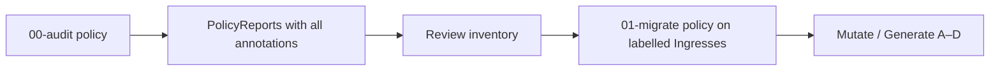

# ingress-nginx → F5 NGINX Ingress — Kyverno PoC policies

Kyverno policies aligned with the [Ingress NGINX Migration Guide](https://kubernetes.nginx.org/ingress-nginx-migration.html) and the PoC patterns in `KYVERNO-POLICY-REQUIREMENTS.md` (patterns **A–D**).

## Workflow



### 1. Audit (PolicyReports)

```bash
kubectl apply -f kyverno/00-audit-ingress-annotations.yaml
```

- **`report-all-metadata-annotations`** — every `Ingress`; message contains **all** annotations (except `kubectl.kubernetes.io/last-applied-configuration`).
- **`report-ingress-nginx-annotations-and-pattern`** — only Ingresses with `nginx.ingress.kubernetes.io/*`; message lists those keys/values plus migration hints.

```bash
kubectl get policyreport -A
kubectl get clusterpolicyreport

# Per-namespace detail
kubectl get policyreport -n app-demo -o jsonpath='{range .items[*].results[*]}{.rule}{"\t"}{.resources[0].name}{"\t"}{.message}{"\n"}{end}'
```

Background scanning requires `background: true` (already set). Allow a short interval after install for reports to populate.

### 2. Migrate (mutate / generate)

After audit review, opt in Ingresses with:

```yaml
labels:
  migration.nginx.org/poc: enabled
```

```bash
# Create namespace + samples (optional)
kubectl create namespace app-demo --dry-run=client -o yaml | kubectl apply -f -
kubectl apply -f samples/

# Tune Pattern B target ConfigMap to match your NIC install, then:
kubectl apply -f kyverno/01-migrate-ingress-nginx-poc.yaml
```

| Pattern | ingress-nginx trigger | Kyverno action | Target |
|--------|------------------------|----------------|--------|
| **A** | `ssl-redirect: "true"` | **mutate** | `nginx.org/redirect-to-https: "true"` |
| **B** | `proxy-body-size` | **generate** (sync) | ConfigMap `nginx-configuration` in `nginx-ingress` → `client-max-body-size` |
| **C** | `auth-type: basic` + `auth-secret` | **generate** + **mutate** | `Policy` `<name>-basic-auth`, `nginx.org/policies` |
| **D** | `enable-cors: "true"` | **generate** + **mutate** | `Policy` `<name>-cors`, `nginx.org/policies` |

**Prerequisites:** Kyverno; F5 NGINX Ingress Controller with `k8s.nginx.org/v1` **Policy** CRD; NIC ConfigMap name/namespace matching Pattern B (`nginx-configuration` / `nginx-ingress` — change in policy if needed).

## Files

| File | Purpose |
|------|---------|
| `kyverno/00-audit-ingress-annotations.yaml` | Audit-only; full annotation inventory in PolicyReports |
| `kyverno/01-migrate-ingress-nginx-poc.yaml` | PoC mutate/generate for patterns A–D |
| `samples/ingress-demo-{a,b,c,d}.yaml` | Example Ingresses from migration requirements |

## Limits (PoC)

- Pattern **B** writes a **shared** controller ConfigMap; multiple Ingresses with different `proxy-body-size` values will converge on one value (production needs a conflict strategy).
- Pattern **D** splits comma-separated CORS lists; avoid spaces after commas in annotations (see `ingress-demo-d.yaml`).
- Not a full catalog of 130+ annotations — extend rules using audit PolicyReports as inventory input.

## References

- [authentication-basic](https://kubernetes.nginx.org/ingress-nginx-migration.html#authentication-basic)
- [CORS](https://kubernetes.nginx.org/ingress-nginx-migration.html#cors)
- [Kyverno PolicyReports](https://kyverno.io/docs/policy-reports/)
